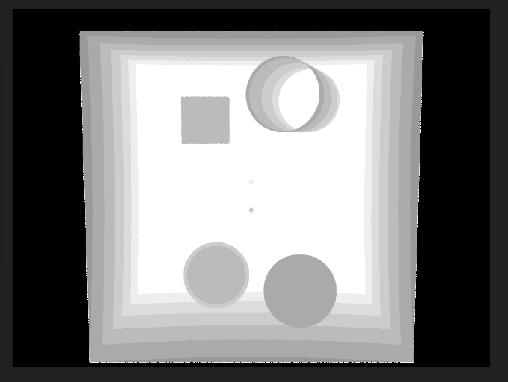
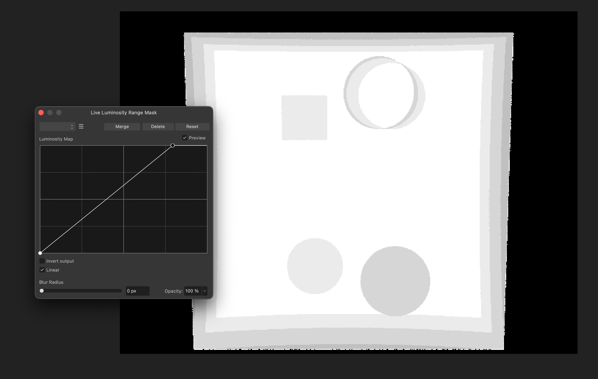
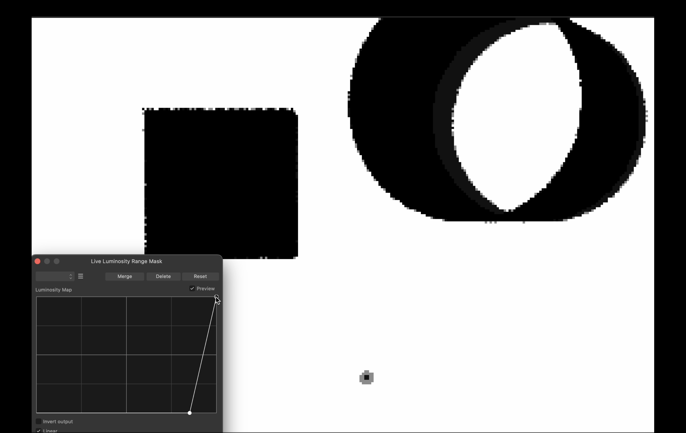
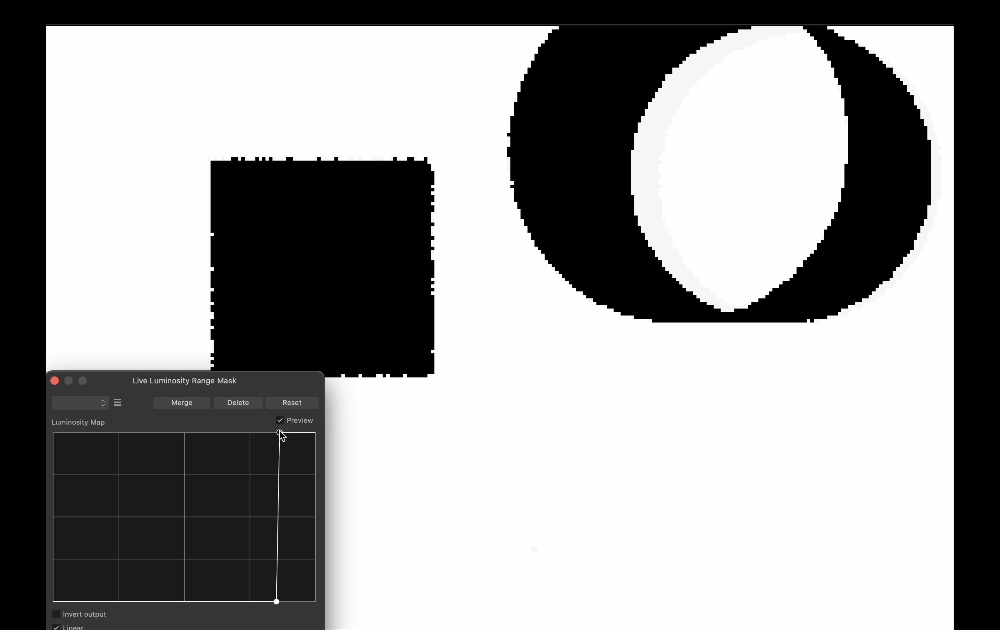

# IFT3355 | Raytracer

Your names and student IDs:

- Etienne Collin | 20237904
- Louis Malenfant-Poulin | 20120851

## Important

For some reason, compiler optimizations of `-O2` and higher prevent the code from functioning correctly (`-O1` is the highest optimization preset that works properly).

Normally, to compile the code, simply run `./build.sh -r`. The `-r` flag is used to compile in functional release mode, and omitting `-r` compiles in debug mode. **CAUTION**, some custom scenes have been created and can take a long time to generate (4K images with many samples and a high max ray depth).

To render the scenes, you can either directly run the generated executable `./build/RAY <scene.ray>`, or run `./render_all.sh`, which will render all scenes in parallel. The latter script has a runtime of about 1 minute. Since the scenes are rendered in parallel, use the `-l` flag to generate one (1) log file per scene that contains all the messages printed to `stdout` by the executable. These logs will be placed in `./logs/`.

## Notes

Some additional features have been added beyond the requested ones.

- Our refraction uses a stack to achieve realistic refraction. The stack contains `(id, IOR)` pairs, where `id` is the object's index and `IOR` is its index of refraction. The results obtained are therefore different from the references, which use `eta=1/mat.refractive_index`.
  - `./src/basic.h`: Added an `ior_stack` in the `RAY` class, which contains the stack described above.
  - `./src/basic.h`: Added a `#define WORLD_IOR` in the `RAY` class, which defines the base refractive index of the world (1.0 for air).
  - `./src/object.h`: Added an `obj_id` in the `Intersection` class, which defines the index of the object hit.
  - `./src/container.cpp`: Calculated the `obj_id` of the hit object in `BVH::intersect` and `Naive::intersect`.
  - `./src/raytracer.cpp`: Managed the `ior_stack` and refraction calculations in `Raytracer::trace`.
- Our refraction supports total internal refraction.
- Our raytracer is multi-threaded. Each column of pixels is generated in parallel, and the generation of the `BVH` and `AABB` before rendering processes the object list in parallel.
  - `./src/basic.h`: Imported `#include <future>` for parallelism.
  - `./src/raytracer.cpp`: Added parallelism to the generation of pixel columns in `Raytracer::render`.
  - `./src/container.h`: Parallel processing of objects in the constructors of the `BVH` and `AABB` classes.

## Errors in the References

Two spheres were added at the position of the lights in `all_at_once.ray`.

With the luminosity masking, we can observe that the two light sources cannot project **direct** light through the front hole of the cylinder, as they are too far back in the scene (this is shown by the masking disappearing from the light spheres before reaching the front of the cylinder).

For the farthest light, it seems to be positioned approximately at the same level as the back of the cylinder, maybe even a bit closer to the camera. Thus, its angle of incidence is definitely not steep enough to reach the interior front of the cylinder. See the following two images.

Similarly, in `pcylinder.ray`, the cylinder should not be illuminated inside; the angle of the lights allows only a small halo of light at the two ends of the cylinder, but not in its center.

It is possible that the code generating the references encountered a bug when calculating cylinder intersections with themselves. In fact, it seems that this version does not account for the shadows the cylinder casts on itself. This could explain why our code produces the same results as the references, except for scenes containing cylinders.
