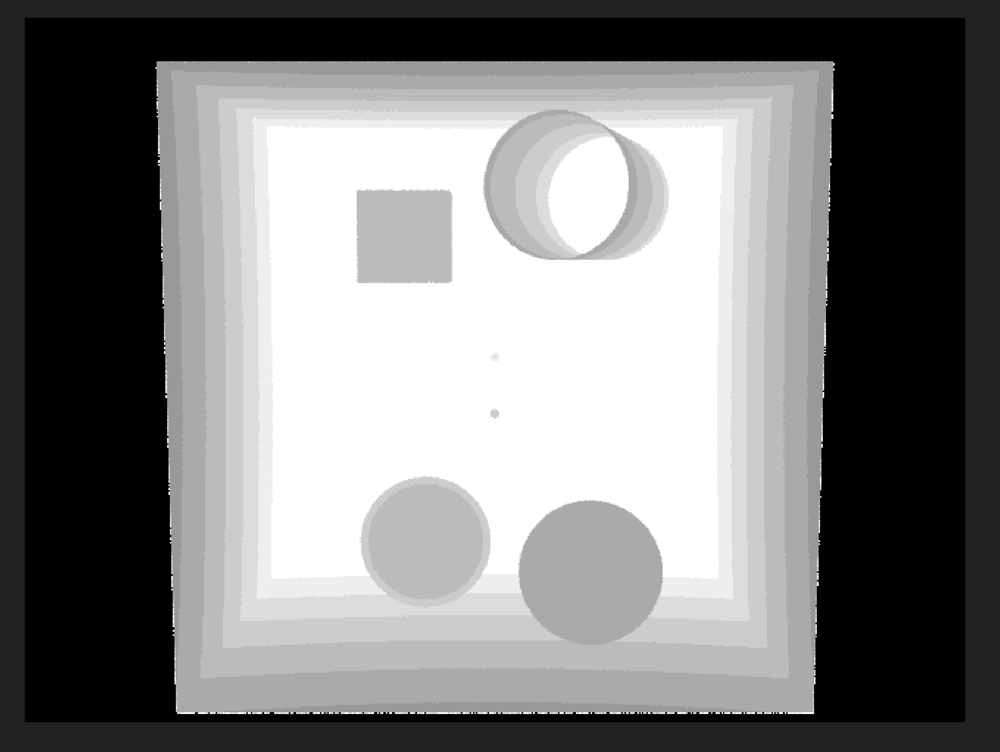

# IFT3355 | Raytracer

Vos noms et matricules:

- Etienne Collin | 20237904
- Louis Malenfant-Poulin | 20120851

## Important

Pour une quelconque raison, les optimisations de `-O2` et plus du compilateur empêchent le code de fonctionner correctement (`-O1` est le plus haut _preset_ d'optimisation qui est fonctionnel).

Normalement, pour compiler le code, simplement exécuter `./build.sh -r`. Le _flag_ `-r` est pour compiler en mode _release_ fonctionnel, et l'absence du `-r` est pour compiler en mode _debug_. **ATTENTION**, certaines scènes personnalisées ont été créés et sont très longues à générer (des images 4K avec beaucoup de _samples_ et un _max ray depth_ élevé).

Pour _render_ les scènes, il est possible de soit exécuter directement l'exécutable généré `./build/RAY <scene.ray>`, soit d'exécuter `./render_all.sh` qui fera le render de toutes les scènes en parallèle. Ce dernier script a un temps d'exécution d'environ 1 minute. Puisque les scènes sont _rendered_ en parallèle, utilisez le _flag_ `-l` afin de générer un (1) fichier de logs par scène qui contient tous les messages écrits dans le `stdout` par l'exécutable. Ces logs seront placés dans `./logs/`

## Notes

Certaines fonctionnalités ont été ajoutées en plus de celles demandées.

- Notre réfraction utilise un _stack_ afin d'obtenir une réfraction réaliste. Le _stack_ contient des paires `(id, IOR)` où l'`id` est l'index de l'objet et l'`IOR` est son indice de réfraction. Les résultats obtenus sont donc différents des références qui utilisent un `eta=1/mat.refractive_index`.
  - `./src/basic.h`: Ajout d'un `ior_stack` dans la classe `RAY` qui contient le _stack_ décrit au point précédent.
  - `./src/basic.h`: Ajout d'un `#define WORLD_IOR` dans la classe `RAY` qui définit l'indice de réfraction de base du monde (1.0 pour de l'air).
  - `./src/object.h`: Ajout d'un `obj_id` dans la classe `Intersection` qui définit l'index de l'objet frappé.
  - `./src/container.cpp`: Calcul de l'`obj_id` de l'objet frappé dans `BVH::intersect` et `Naive::intersect`.
  - `./src/raytracer.cpp`: Gestion du `ior_stack` et calculs de réfraction dans `Raytracer::trace`.
- Notre réfraction supporte la réfraction interne totale.
- Notre raytracer est _multi-threaded_. Chaque colonne de pixels est générée en parallèle, et la génération de `BVH` et de `AABB` avant le _render_ traite la liste d'objets en parallèle.
  - `./src/basic.h`: Importation de `#include <future>` pour le parallélisme.
  - `./src/raytracer.cpp`: Ajout de parallélisme à la génération des colonnes de pixels dans `Raytracer::render`.
  - `./src/container.h`: Traitement parallèle des objets dans les constructeurs des classes `BVH` et `AABB`.

## Erreurs dans les références

Deux sphères ont été ajoutées à la position des lumières dans `all_at_once.ray`.

Avec le masking de luminosité, on peut observer que les deux sources lumineuses ne peuvent pas projeter de lumière **directe** à travers le trou avant du cylindre, car elles sont trop reculées dans la scène (ce que montre le masking en faisant disparaître les sphères lumineuses avant d'atteindre le devant du cylindre).

Pour la lumière la plus éloignée, elle semble se situer à peu près au même niveau que l'arrière du cylindre, peut-être même un peu plus près de la caméra. Ainsi, son angle d'incidence n'est définitivement pas suffisamment élevé pour atteindre l'intérieur avant du cylindre. Voir les deux images suivantes.

Similairement, dans `pcylinder.ray`, le cylindre ne devrait pas être éclairé à l'intérieur; l'angle avec les lumières permet uniquement un petit hâlo de lumière aux deux extrémités du cylindre, mais pas en son centre.

Il est possible que le code ayant généré les références ait rencontré un bug lors du calcul des intersections des cylindres avec eux mêmes. En effet, il semble que cette version ne prenne pas en compte les ombres que le cylindre projette sur lui-même. Cela pourrait expliquer pourquoi notre code produit les mêmes résultats que les références sauf pour les scènes contenant des cylindres.
